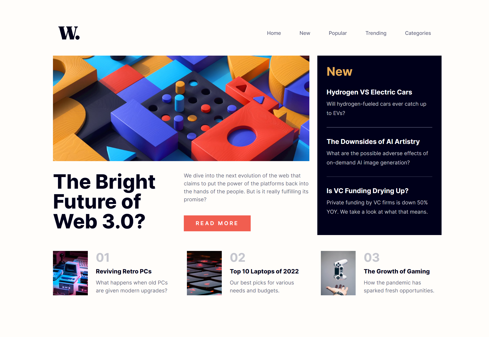

# Frontend Mentor - News homepage solution

This is a solution to the [News homepage challenge on Frontend Mentor](https://www.frontendmentor.io/challenges/news-homepage-H6SWTa1MFl). Frontend Mentor challenges help you improve your coding skills by building realistic projects.

## Table of contents

- [Overview](#overview)
  - [The challenge](#the-challenge)
  - [Screenshot](#screenshot)
  - [Links](#links)
- [My process](#my-process)
  - [Built with](#built-with)
  - [What I learned](#what-i-learned)
  - [Continued development](#continued-development)
  - [Useful resources](#useful-resources)
- [Author](#author)

## Overview

### The challenge

Users should be able to:

- View the optimal layout for the interface depending on their device's screen size
- See hover and focus states for all interactive elements on the page

### Screenshot

### Links

- Solution URL: [GitHub Repository](https://github.com/Luzefiru/news-homepage)
- Live Site URL: [GitHub Pages](https://luzefiru.github.io/news-homepage/)

## My process

1. I created utility classes for the style guide specifications.
2. Created semantic HTML tags for the initial page document structure.
3. Implemented the Desktop design.
4. Implemented the Mobile design.
5. Deployed to `gh-pages`.

### Built with

- [React](https://reactjs.org/) - JS library
- Tailwind CSS
- Semantic HTML5 markup
- Accessible `aria-label` tags
- Flexbox
- CSS Grid

### What I learned

I learned that it is way harder to design pages without doing mobile-first design. Next time, I'll make the mobile navigation bar component or anything interactive - first - before proceeding to the easy layout designs.

I also learned how to implement a responsive[Hamburger Menu](https://alvarotrigo.com/blog/hamburger-menu-css/) using Tailwind CSS.

I also learned that using React with Tailwind CSS helps me manage the messy HTML Utility Classes because I can encapsulate each element to its own `.jsx` file.

### Continued development

Note to self: do the interactive & complex components first - before proceeding to the easier components.

### Useful resources

- [Tailwind CSS Documentation](https://tailwindcss.com/docs) - I needed a bit of handholding to use Tailwind CSS.

## Author

- Website - [Christian de Jesus IV](https://luzefiru.github.io/Portfolio/)
- Frontend Mentor - [@Luzefiru](https://www.frontendmentor.io/profile/Luzefiru)
